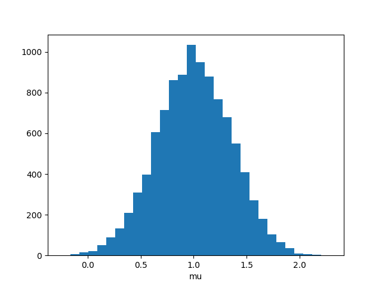

# Stochastic simulations

Stochastic simulations are supported via the Euler-Maruyama method. Random normal variables $W_t\sim N(0, dt)$ can be included in the vector field function, and each simulation instance will have an independent stream of random variables.

As an example, consider the [Ornstein-Uhlenbeck process](https://en.wikipedia.org/wiki/Ornstein-Uhlenbeck_process) with $\theta = 1$:

$$ dx_t = (\mu - x_t)dt + \sigma W_t $$

To implement this system, we heuristically write it in Langevin form:

$$ \frac{dx}{dt} = \mu - x + \sigma\eta(t)$$

where $\eta(t)$ represents white noise. When $\sigma=0$, the system is a first-order ODE with steady state x=$\mu$. Increasing $\sigma$ produces solutions with a steady state distribution $x\sim N(\mu, \frac{\sigma^2}{2})$.

```python
import numpy as np
import matplotlib.pyplot as plt
import clode

# Define the Wiener_process
def wiener_process(
        t: float,
        y: list[float],
        mu: float,
        sigma: float,
        weiner_variable: float,
) -> list[float]:
    x: float = y[0]
    dx: float = mu - x + sigma*weiner_variable
    return dx

variables = {"x": 0.0}
parameters = {"mu": 1.0, "sigma":0.5}
 
# convenience:
variable_names = list(variables.keys())
initial_state = list(variables.values())
parameter_names = list(parameters.keys())
default_parameters = list(parameters.values())

# set up the ensemble of Wiener processes with identical parameters and initial conditions
nPts = 8192
Pars = np.tile(default_parameters, (nPts, 1))
X0 = np.tile(initial_state, (nPts, 1))

tspan = (0.0, 1000.0)

integrator = clode.Simulator(
    src_file=src_file,
    variable_names=variable_names,
    parameter_names=parameter_names,
    num_noise=1,
    stepper=clode.Stepper.stochastic_euler,
    single_precision=True,
    tspan=tspan,
    dt=0.001,
)

integrator.initialize(X0, Pars)
integrator.transient()

XF = integrator.get_final_state()

print(f"mean xf: {np.mean(XF) :0.5}")
print(f"simulation variance: {np.var(XF) :0.5}") 
print(f"expected variance: {parameters['sigma']**2 / 2 :0.5}")

plt.hist(XF, 30)
plt.xlabel("x")
plt.show()
```

Output:

```bash
mean xf: 1.0041
simulation variance: 0.12629
expected variance: 0.125
```


