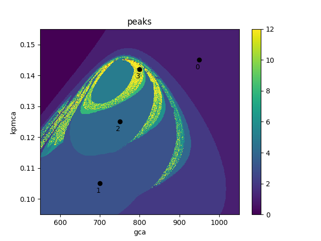
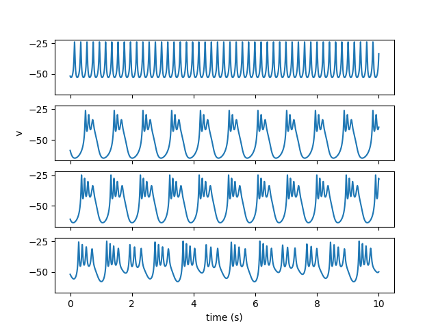

# Spike counting simulation example

Bursting in excitable cells is the grouping of fast spikes into clusters, or bursts. It arises when the fast spiking dynamics are modulated by one or more slower variables. This example shows *pseudo-plateau bursting* in a simple model similar to a foundational model of pancreatic beta cells due to Teresa Chay and Joel Keizer. The model has two fast variables, voltage ($v$) and delayed-rectifier potassium channel activation ($n$), and one "slow" variable, calcium concentration ($c$). Here, $c$ is not much slower $n$, which is important for the pseudo-plateau bursting mechanism.

When studying bursting, numerical simulations can be used to observe the transitions from spiking to increasingly long bursts via *spike-adding bifurcations*. Here we show how the number of spikes per burst varies as a function of two parameters, the voltage-dependent calcium channel conductance ($g_{Ca}$) and the plasma membrane calcium ATPase pump rate ($k_{PMCA}$).

The model definition in OpenCL:
```c
void getRHS(const realtype t,
            const realtype x_[],
            const realtype p_[],
            realtype dx_[],
            realtype aux_[],
            const realtype w_[]) {

    /* State variables */
    realtype v = x_[0];
    realtype n = x_[1];
    realtype c = x_[2];

    /* Parameters */
    realtype gca = p_[0];
    realtype gkca = p_[1];
    realtype kpmca = p_[2];
    realtype gk = RCONST(3500.0);

    realtype vca = RCONST(25.0);
    realtype vk = RCONST(-75.0);
    realtype cm = RCONST(5300.0);
    realtype alpha = RCONST(4.5e-6);
    realtype fcyt = RCONST(0.01);
    realtype kd = RCONST(0.4);
    realtype vm = RCONST(-20.0);
    realtype sm = RCONST(12.0);
    realtype vn = RCONST(-16.0);
    realtype sn = RCONST(5.0);
    realtype taun = RCONST(20.0);
    
    /* functions */
    realtype minf=RCONST(1.0)/(RCONST(1.0)+exp((vm-v)/sm));
    realtype ninf=RCONST(1.0)/(RCONST(1.0)+exp((vn-v)/sn));
    realtype omega=pown(c, 2)/(pown(c, 2)+pown(kd, 2));

    realtype ica=gca*minf*(v-vca);
    realtype ik=gk*n*(v-vk);
    realtype ikca=gkca*omega*(v-vk);

    /* Differential equations */
    dx_[0] = -(ica + ik + ikca)/cm;
    dx_[1] = (ninf-n)/taun;
    dx_[2] = fcyt*(-alpha*ica - kpmca*c);
}
```

The following script runs the two-parameter sweep using the clODE FeatureSimulator to generate a *spike counting diagram*, as well as some trajectories of interest using the TrajectorySimulator.

```python
src_file = "chay_keizer.cl"

variables = {"v": -50.0, "n": 0.01, "c": 0.12}
parameters = {"gca": 1200.0, "gkca": 750.0, "kpmca": 0.1}

# convenience:
variable_names = list(variables.keys())
initial_state = list(variables.values())
parameter_names = list(parameters.keys())
default_parameters = list(parameters.values())

# set up the ensemble of systems

nx = 512
ny = 512
gca = np.linspace(550.0, 1050.0, nx)
kpmca = np.linspace(0.095, 0.155, ny)
# gkca = np.linspace(0.0, 1000, ny)

x_idx = 0
y_idx = 2

nPts = nx * ny

# px, py = np.meshgrid(gkca, indexing="xy") #ij vs xy?
# px, py = np.meshgrid(kpmca, gkca) 
px, py = np.meshgrid(gca, kpmca)

Pars = np.tile(default_parameters, (nPts, 1))
Pars[:, x_idx] = px.flatten()
Pars[:, y_idx] = py.flatten()

X0 = np.tile(initial_state, (nPts, 1))
X0 = X0 + (np.random.random((Pars.shape[0], 1)) - 0.5) * [20.0, 0.0, 0.1]

integrator = clode.FeaturesSimulator(
    src_file=src_file,
    variable_names=variable_names,
    parameter_names=parameter_names,
    single_precision=True,
    stepper=clode.Stepper.dormand_prince,
    dt=0.001,
    dtmax=0.1,
    abstol=1e-6,
    reltol=1e-5,
    event_var="v",
    feature_var="v",
    observer=clode.Observer.threshold_2,
    observer_x_up_thresh=0.5,
    observer_x_down_thresh=0.05,
    # observer=clode.Observer.neighbourhood_2,
    # observer_neighbourhood_radius=0.05,
    observer_min_x_amp=5.0,
    observer_min_imi=0.0,
    observer_max_event_count=1000,
)

integrator.set_ensemble(X0, Pars)

integrator.set_tspan((0.0, 50000.0))
integrator.transient()

integrator.set_tspan((0.0, 10000.0))
integrator.features()

features = integrator.get_observer_results()

feature = features.get_var_max("peaks")
feature = np.reshape(feature, (nx, ny))

plt.pcolormesh(px, py, feature, shading='nearest', vmax=12)
plt.title("peaks")
plt.colorbar()
plt.xlabel(parameter_names[x_idx])
plt.ylabel(parameter_names[y_idx])

plt.axis("tight")

points = np.array([[950, 0.145], [700, 0.105], [750, 0.125], [800, 0.142]])
plt.plot(points[:, 0], points[:, 1], 'o', color='black')

for i, txt in enumerate(range(4)):
    plt.annotate(txt, (points[i, 0] - 10, points[i, 1] - 0.003))

# plt.show()


steps_taken = features.get_var_count("step")
max_steps = int(np.max(steps_taken))
print(f"max steps taken: {max_steps}")
# Now get the trajectories

integrator_traj = clode.TrajectorySimulator(
    src_file=src_file,
    variable_names=variable_names,
    parameter_names=parameter_names,
    single_precision=True,
    stepper=clode.Stepper.dormand_prince,
    dt=0.001,
    dtmax=0.1,
    abstol=1e-6,
    reltol=1e-5,
    max_steps=2 * max_steps,  # must be int
    max_store=2 * max_steps,
)

Pars_traj = np.tile(default_parameters, (4, 1))
Pars_traj[:, x_idx] = points[:, 0]
Pars_traj[:, y_idx] = points[:, 1]
X0_traj = np.tile(initial_state, (4, 1))

integrator_traj.set_ensemble(X0_traj, Pars_traj)

integrator_traj.set_tspan((0.0, 50000.0))
integrator_traj.transient()

integrator_traj.set_tspan((0.0, 10000.0))
integrator_traj.trajectory()

trajectories = integrator_traj.get_trajectory()

varix = 0
fig, ax = plt.subplots(4, 1, sharex=True, sharey=True)

for i, trajectory in enumerate(trajectories):
    ax[i].plot(trajectory["t"] / 1000.0, trajectory["X"][:, varix])

ax[1].set_ylabel(variable_names[varix])
ax[-1].set_xlabel('time (s)')
plt.show()
```

## Output

The spike counting diagram shows silent, spiking, and bursting regions. Chaotic dynamics occur near some of the spike-adding bifurcation boundaries (yellow indicates >=12 spikes per event, as detected with the threshold observer method). The trajectories associated with the numbered points are shown in the following figure.



